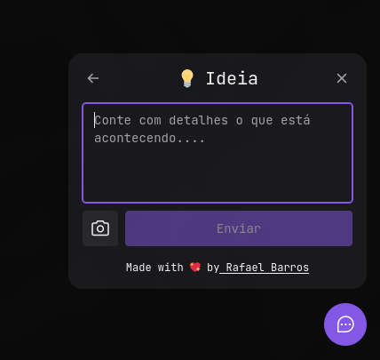

<h1 align="center">
  FeedGet
</h1>

<p align="center">
  
</p>

## 💻 Projeto

This project has builded during **NLW Return Event**
The app prototype was created by [**Ilana Mallak**](https://www.instagram.com/ilanamallak/), [Click here](https://www.figma.com/file/4OgcQfKrfG6zjASK6pKg1a?node-id=10%3A1637) to open the
prototype in FIGMA.

Project Dependencies:

- [Vite](https://vitejs.dev/)
- [ReactJS](https://reactjs.org/)
- [Tailwind](https://tailwindcss.com/)
- [Headlessui](https://headlessui.dev/)
- [TypeScript](https://www.typescriptlang.org/)

## ⚙️ New features

- [ ] Toggle dark/light mode
- [ ] Refactor the components to abstraction.
- [ ] Feedbacks list

## 📥 Instalação e execução

Faça um clone desse repositório e acesse o diretório.

PS: _Adicione o host do servidor na variável VITE_API_HOST no arquivo env.example_

PS 2: _Renomei o arquivo env.example para env.local_

```bash
# Instalando as dependências
$ npm install

# Executanto aplicação
$ npm run dev
```
